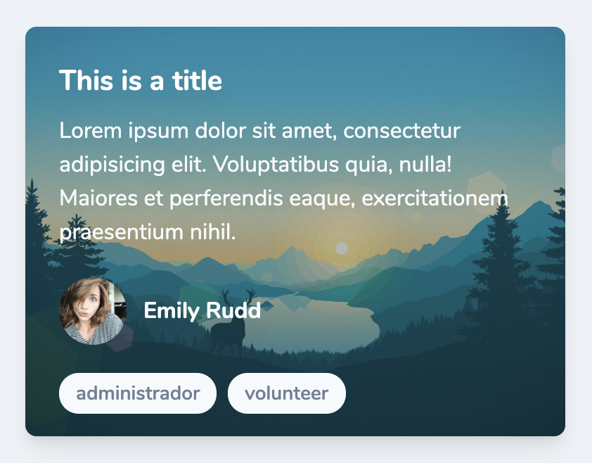

<p align=center>😎😎😎</p>
<p align=center>Good looking components for Vue.js usign Tailwind css 👉 https://github.com/DannyAndres/future-vue-components</p>
<p align=center>🤙🏻🤙🏻🤙🏻</p>

---

<div align="center">
  <div class="d-flex justify-content-center align-items-center">
    
    
  </div>
  <br>
  
  <br>
  <div class="d-flex justify-content-center align-items-center">
    
    
  </div>
  <br>
  <h1>Future Vue/Tailwind Components</h1>
  <p>👌🏻 Simple, futuristic design for components with no effort</p>
  <br>
  <a href="https://www.npmjs.com/package/future-vue-components"></a>
  

</div>

## Installation
_install moment , animate.css , tailwind_
```shell
npm install --save future-vue-components
```
_in case of error when you import css files from tailwind, try the complete route from where the @import is_
<br>
_(main.scss file) => /src/assets/scss/main.scss_
```scss
 @import "./../../../node_modules/tailwindcss/dist/base.css";
 @import "./../../../node_modules/tailwindcss/dist/components.css";
 @import "./../../../node_modules/tailwindcss/dist/utilities.css";
 ```
 > ⚠️ **Warning**: due to a bug already issued it to momentjs, other locales as spanish are not available for the moment, this error is shown as Can't resolve './locale'
<br>

## Usage

```js
import Vue from "vue"

import Card from 'future-vue-components'
Vue.use(Datepicker)

import Datepicker from 'future-vue-components'
Vue.use(Card)
```

_vue template_

```html
<!-- Card -->
<future-card
  :user="{
    avatar_url: 'https://i.pinimg.com/originals/39/ec/15/39ec15a87824a1bdd57484e6a5459593.jpg',
    name: 'emily rudd'
  }"
>
  <span slot="title">This is a title</span>
  <span>
    Lorem ipsum dolor sit amet, consectetur adipisicing elit. Voluptatibus quia, nulla! Maiores et perferendis eaque, exercitationem praesentium nihil.
  </span>
</future-card>

<!-- Datepicker -->
<input
  @click="datepicker = true"
  type="text"
  placeholder="date"
  autocomplete="off"
  spellcheck="false"
  readonly="readonly"
  v-model="date"
>
<future-datepicker
  :show="datepicker"
  @close="datepicker = false"
  @date="(datepicker) => {date = datepicker}"  
/>
```

_vue template_

```javascript
export default {
  props: {},
  data() {
    return {
      date: '',
      datepicker: false,
    }
  },
};
```

## Props

### Datepicker

| Name              | Type           | Default     | Description                                                                                                                                                                                                                                       | Example                                                                      |
| ----------------- | -------------- | ----------- | ------------------------------------------------------------------------------------------------------------------------------------------------------------------------------------------------------------------------------------------------- | ---------------------------------------------------------------------------- |
| color             | String         | `indigo`    | All colors accepted by Tailwind at https://tailwindcss.com/docs/customizing-colors/#default-color-palette. | `'red'` or `'gray'` |
| background        | Boolean        | `true`      | Whether the datepicker shows a background image or not. | `true` or `false` |
| show              | Boolean        | `false`     | Whether the datepicker shows itself or not, is used to enable the modal and quit it. | `true` or `false` |
| background_url    | String         | `https://www.xtrafondos.com/wallpapers/montanas-en-bosque-minimalista-flat-3306.jpg` | Default url for a background image if need it. | - |

### Card

| Name              | Type           | Default     | Description                                                                                                                                                                                                                                       | Example                                                                      |
| ----------------- | -------------- | ----------- | ------------------------------------------------------------------------------------------------------------------------------------------------------------------------------------------------------------------------------------------------- | ---------------------------------------------------------------------------- |
| color             | String         | `gray`      | All colors accepted by Tailwind at https://tailwindcss.com/docs/customizing-colors/#default-color-palette. | `'red'` or `'gray'` |
| background        | Boolean        | `true`      | Whether the datepicker shows a background image or not. | `true` or `false` |
| type              | String         | `normal`    | It represents the card style that's shown. | `normal` or `full-image` |
| user              | Object         | `null`      | User's card data. | `{avatar_url: 'https://i.pinimg.com/originals/39/ec/15/39ec15a87824a1bdd57484e6a5459593.jpg',name: 'emily rudd'}` |
| badges            | Array          | `[]`        | All the badges that are going to be shown. | `['admin','volunteer']` |
| background_url    | String         | `https://i.pinimg.com/originals/54/ce/a7/54cea70579cfefc972a4cbf67f92ea59.jpg` | Default url for a background image if need it. | - |

## Development

```sh
npm install
npm run Test
# open localhost:8080
```

## TODO

- Datepicker choose by year
- Fix .locale moment bug

## License

MIT
