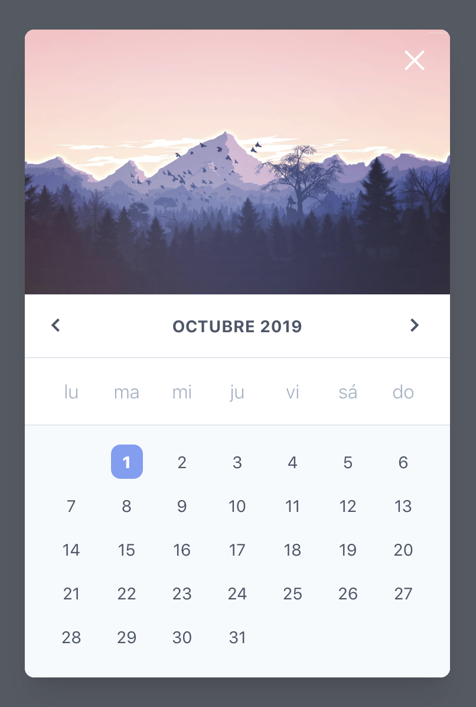
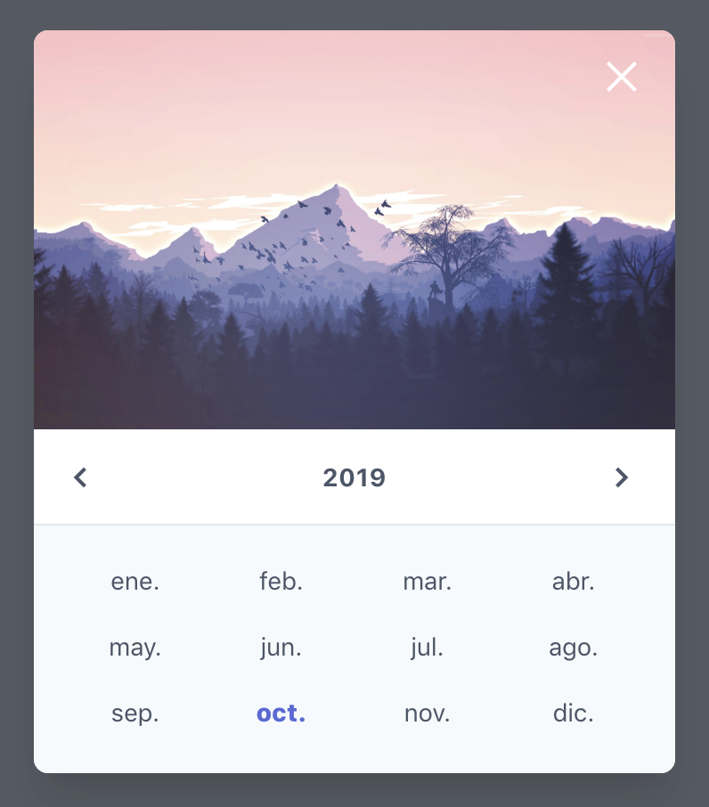

<p align=center>😎😎😎</p>
<p align=center>Good looking components for Vue.js usign Tailwind css 👉 https://github.com/DannyAndres/future-vue-components</p>
<p align=center>🤙🏻🤙🏻🤙🏻</p>

---

<div align="center">
  <div class="d-flex justify-content-center align-items-center">
    
    
  </div>
  <br>
  <h1>Future Datepicker</h1>
  <p>👌🏻 Simple, futuristic design for components with no effort</p>
  <br>
  <a href="https://www.npmjs.com/package/future-vue-components"></a>
  

</div>

## Installation
_install moment, animate.css, tailwind_
```shell
npm install --save future-vue-components
```

## Usage

```js
import Vue from "vue"
import Datepicker from 'future-vue-components'

Vue.use(Datepicker)
```

_vue template_

```html
<input
  @click="datepicker = true"
  type="text"
  placeholder="date"
  autocomplete="off"
  spellcheck="false"
  readonly="readonly"
  v-model="date"
>
<future-datepicker
  :show="datepicker"
  @close="datepicker = false"
  @date="(datepicker) => {date = datepicker}"  
/>
```

_vue template_

```javascript
export default {
  props: {},
  data() {
    return {
      date: '',
      datepicker: false,
    }
  },
};
```

## Props

| Name              | Type           | Default     | Description                                                                                                                                                                                                                                       | Example                                                                      |
| ----------------- | -------------- | ----------- | ------------------------------------------------------------------------------------------------------------------------------------------------------------------------------------------------------------------------------------------------- | ---------------------------------------------------------------------------- |
| color             | String         | `indigo`    | All colors accepted by Tailwind at https://tailwindcss.com/docs/customizing-colors/#default-color-palette. | `'red'` or `'gray'` |
| background        | Boolean        | `true`      | Whether the datepicker shows a background image or not. | `true` or `false` |
| show              | Boolean        | `false`     | Whether the datepicker shows itself or not, is used to enable the modal and quit it. | `true` or `false` |
| background_url    | String         | `https://www.xtrafondos.com/wallpapers/montanas-en-bosque-minimalista-flat-3306.jpg` | Default url for a background image if need it. | - |

## Development

```sh
npm install
npm run Datepicker
# open localhost:8080
```

## TODO

- Datepicker choose by year

## License

MIT
